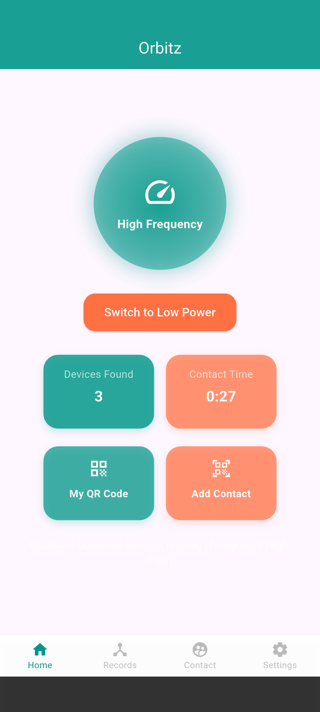
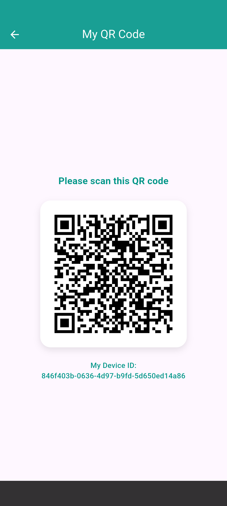
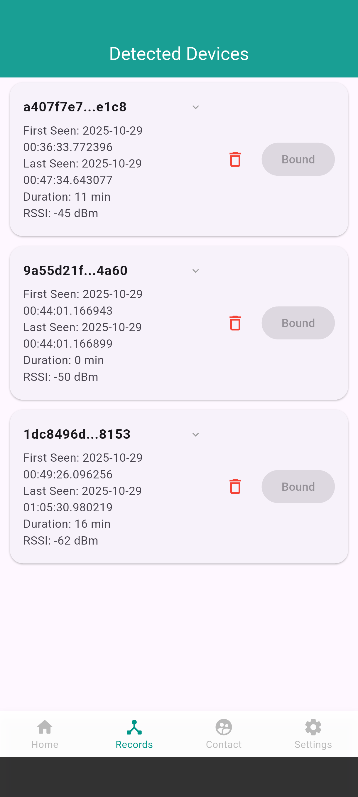
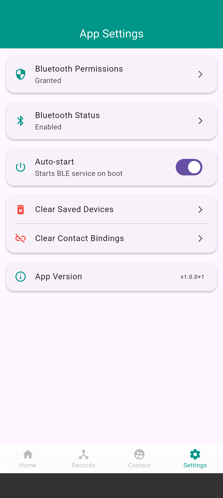

# Orbits
**Privacy-Preserving BLE Proximity Detection for Diabetes Emergency Response**

---

## 📌 Overview
Orbits is a privacy-preserving mobile system designed for diabetes emergency support within a Virtual Hospital context.
The system leverages Bluetooth Low Energy (BLE) proximity detection to identify nearby trusted contacts when a hypoglycemia event occurs, enabling timely alerts and assistance without relying on precise location tracking.
The project was independently designed, implemented, evaluated, and published as part of an academic research initiative.
## 📱 App Showcase
<p align="center">


</p>
<p align="center">



</p>

<p align="center"><i>From top to bottom: Core Dashboard, Privacy-Preserving QR Exchange, Device Discovery, Contact Management, and System Settings.</i></p>

---

## 🏥 Background & Motivation
Severe hypoglycemia can cause loss of consciousness and requires **rapid intervention**.
Traditional solutions often depend on GPS-based location tracking or centralized servers, raising privacy and reliability concerns.

Orbits explores an alternative approach:

- Detect nearby contacts using BLE instead of GPS
- Preserve user privacy via rolling, non-persistent identifiers
- Enable local, real-time emergency awareness in a Virtual Hospital ecosystem

---

## 🎯 Key Features
- 🔹 BLE-based proximity detection without location tracking
- 🔹 Privacy-preserving Rolling ID mechanism (HMAC-SHA256)
- 🔹 Continuous background scanning & broadcasting on Android
- 🔹 Cross-platform Flutter architecture
- 🔹 Local-first design (no cloud dependency required)
- 🔹 Experimental validation of distance and signal reliability

---

## 🧠 System Architecture
```text
┌──────────────────────┐
│   Flutter UI Layer   │
│  (Provider / RxDart) │
└─────────▲────────────┘
          │
┌─────────┴────────────┐
│ Platform Channels    │
│ Method / Event       │
└─────────▲────────────┘
          │
┌─────────┴────────────┐
│ Android Native Layer │
│ BLE Foreground Svcs  │
│ (Kotlin)             │
└─────────▲────────────┘
          │
┌─────────┴────────────┐
│ BLE Advertise/Scan   │
│ Rolling ID Matching  │
└──────────────────────┘
```
---

## 🔐 Privacy & Security Design
To prevent long-term tracking and identity leakage, Orbits adopts a Rolling ID protocol inspired by large-scale contact tracing systems.
**Rolling ID Generation**

Each device holds:
- `userUUID`
- `secretKey` (securely stored)

Rolling ID is generated as:
```text
HMAC-SHA256(userUUID : timeInterval, secretKey)→ first 2 bytes used as BLE identifier
```
Validation Strategy
- Devices scan BLE advertisements
- Observed Rolling IDs are matched by:
    - Iterating known contacts
    - Allowing a ±20-minute time drift window
- No persistent identifiers are broadcast
  All sensitive data is stored using platform-level secure storage.

---

## 🧪 Experimental Evaluation
The system was evaluated through controlled device-level experiments, focusing on:
- BLE signal strength (RSSI) vs. distance
- Detection stability across environments
- False positive / false negative behavior
  Experimental results informed system limitations and design trade-offs, and contributed to a research publication.

---

## 🛠️ Tech Stack
Core Technologies
- Flutter / Dart – Cross-platform application framework
- Android (Kotlin) – Native BLE services
- Bluetooth Low Energy (BLE) – Proximity detection
- Platform Channels – Flutter ↔ Android communication
  Data & State
- SQLite (sqflite) – Local contact persistence
- Provider + RxDart – Reactive state management
  Security
- HMAC-SHA256 – Rolling ID generation
- flutter_secure_storage – Secure key storage

---

## 📱 Platform Support
- ✅ Android (fully supported, foreground services enabled)
- ⚠️ iOS (conceptually supported, limited by background BLE constraints)

---

📄 Research Output
This project was developed as part of a Virtual Hospital research initiative and resulted in an academic publication evaluating the feasibility of BLE-based proximity detection for diabetes emergency support.
Publication details can be provided upon request.

---

## 🚀 Getting Started
Prerequisites
- Flutter SDK (Dart ≥ 3.x)
- Android Studio / Android SDK
- BLE-enabled Android device
  Run the Project
```text
git clone https://github.com/Mingyueoo/orbits.git
cd orbits
flutter pub get
flutter run
```

⚠️ BLE advertising and scanning require real devices (emulators are not supported).

---

## ⚠️ Disclaimer
This project is a research prototype and is not intended for clinical deployment without further validation, regulatory approval, and medical oversight.

---

## 👤 Author
Developed independently as part of a Virtual Hospital research project.

